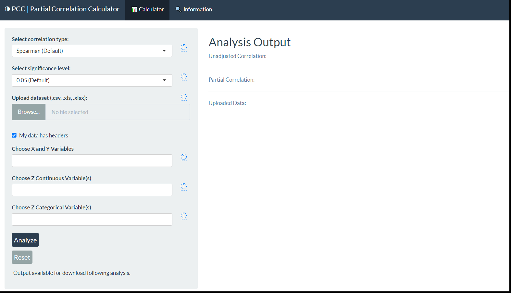
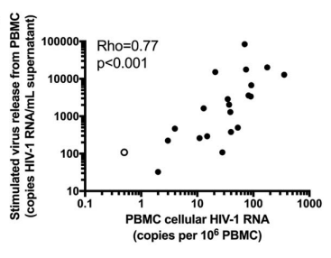

# Summary

The Partial Correlation Calculator (PCC) is an R Shiny application that leverages the `ppcor` R package to compute partial correlation coefficients and p-values, with added functionality for confidence intervals. The graphical user interface (GUI) allows the upload of a data set, variable selection, specification of significance level, and of the correlation type (Pearson, Spearman, or Kendall's Tau). The resulting output is publication-friendly; the inference and associated statistical methods can be downloaded as text files and directly inserted into a manuscript.

# Statement of Need

Laboratories and clinical researchers are often interested in quantifying the magnitude of association between variables. This is typically done by computing a correlation coefficient and assessing the direction of this correlation, or by building inferential statistical models. Non-statistical researchers often use point-and-click software like GraphPad Prism to perform these statistical analyses.

However, in the case of correlation coefficients, there may be a correlation between two variables that is partially explained by one or more other variables, which obfuscates the variables’ true correlation. Furthermore, small sample sizes are common in fields such as immunology. Thus, assumptions of statistical models may not be satisfied, and therefore models cannot reliably quantify the effect of variables. 

Partial correlation is particularly useful in these situations. Partial correlation is an analytic technique that facilitates measurement of the magnitude of association between two variables, while controlling for one or more extraneous variables. Parametric (Pearson) and non-parametric (Spearman and Kendall's Tau) partial correlation coefficients are available, lending the method a high degree of flexibility in its application.

Biostatisticians are frequently approached with requests to compute partial correlations, as laboratory software typically does not offer this functionality. The goal of the PCC is to facilitate calculation of partial correlations by laboratories and clinical researchers via a GUI-based web application.

Researchers of any discipline can use the PCC to quantify the strength of an association between two variables while controlling for the presence of extraneous variables. Consequently, this application should be explored by researchers from any discipline where there is a need to quantify the strength of association between two variables while controlling for the presence of extraneous variables.

# Usage

The source code for the PCC is stored in a GitHub repository. The application itself is hosted on the web, but is also accessible via GitHub. The PCC accepts CSV and XLSX files for upload and users can specify the two primary variables they seek to correlate, as well as the variables for adjustment. Analysis parameters, such as the significance level and correlation type, can also be specified. Once all fields have been populated, users press the Analyze button to execute the calculation. The Download button exports results as plain text for later reference. The Reset button sets all fields to their default values and clears the uploaded data (Fig. 1).

---

Data uploaded to the application is not stored between sessions. Thus, we encourage users to export the results of their analysis by using the download capability. Users are encouraged to visit the GitHub repository for more details on calculator operation and sample HIV/AIDS data. 

# Example Application of Partial Correlation

Cillo et al (2018) reports on the relationships between  measures of viral persistence in blood (i.e., plasma viremia, cellular HIV-1 DNA, and mRNA) and viral matter from resting CD4þ T cells among individuals on suppressive antiretroviral therapy (Cillio et al, 2018).

In this scenario, a particularly key relationship is that of virus release from peripheral blood mononuclear cells (PBMC) and PBMC cellular HIV-1 RNA. The reported unadjusted Spearman correlation between these factors was 0.77 (p-value = 0.0016).

Leveraging partial correlation to adjust for Nadir CD4 T-cell count within patients, the Spearman correlation coefficient between the initial factors falls to 0.63 (p = 0.0153). Although still significantly significant, the magnitude of the correlation coefficent decreased by 0.14 (20%) after adjusting for Nadir CD4 T-cell count. Thus, a more accurate measure of the true association is achieved.

# Acknowledgements

This research was supported in part by the University of North Carolina at Chapel Hill Center For AIDS Research (CFAR), an NIH funded program P30AI050410.
